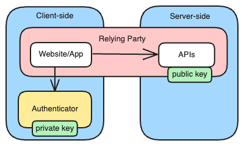

# mock-webauthn

A lightweight Node.js (and browser) mock WebAuthn authenticator.

This module allows testing WebAuthn relying party client or server implementations
without requiring a real FIDO2/Webauthn authenticator.

## What is a webauthn relying party and authenticator?

Passkeys are the most mainstream WebAuthn implementation for consumers.

WebAuthn is a W3C web standard for passwordless authentication
and it's also implemented by mobile platforms like iOS and Android.

The key concepts are illustrated in the diagram below:

* The relying party is an app or website that wants to authenticate a user.

* The relying party server is the server-side component of the relying party.

* An authenticator generates a public/private key pair and stores the private key.

* The public key is registered with a relying party server.

This library mocks the authenticator.

## Alternatives

### Chrome DevTools

You can emulate a WebAuthn authenticator using Chrome:

- [Chrome DevTools - Webauthn](https://developer.chrome.com/docs/devtools/webauthn)
- [Chrome DevTools Protocol - Webauthn (experimental)](https://chromedevtools.github.io/devtools-protocol/tot/WebAuthn/) (for automated tests)

### webauthn-mock (golang)

[webauthn-mock](https://github.com/get-smooth/webauthn-mock) is a golang library for the same/similar purpose.

- it only seems to support the attestion flow
- it had no new commits since May 2024.
